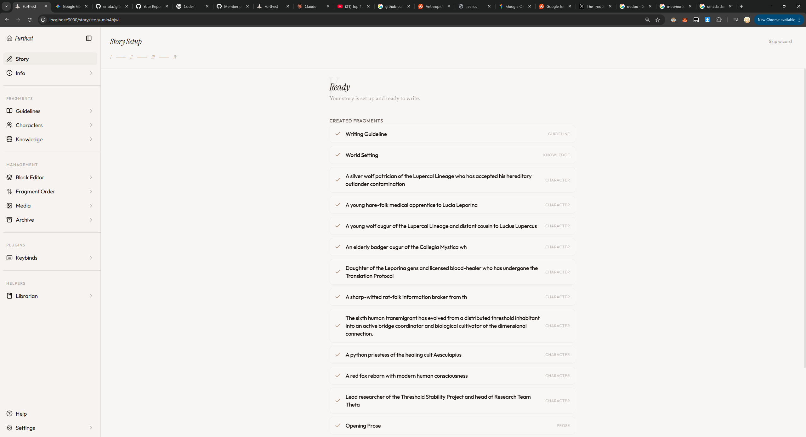
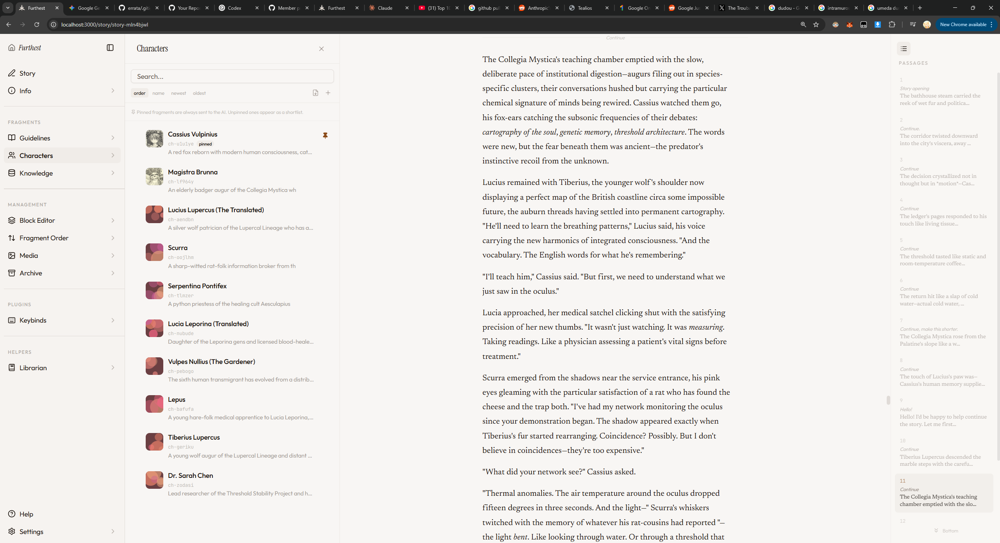

# Errata

An LLM assisted writing app built around a fragment system. Prose, characters, guidelines, and knowledge are composable fragments that assemble into structured LLM context for story generation.

Join the community on Discord: https://discord.gg/ywVFKvdH49


## Features

- **Fragment system** — everything is a fragment with tags, refs, sticky/system placement, and version history
- **Prose chain + writing panel** — branchable prose with regenerate/refine/switch/remove and a dedicated long-form editor view
- **Character Chat mode** — story-scoped chat with streaming responses, provider/model selection, and character portraits
- **Block-based context** — visual editor for reordering, overriding, and extending LLM prompt structure
- **Librarian memory tools** — rolling continuity, hierarchical summaries, contradiction tracking, and summary compaction controls
- **Universal import/export** — drag-and-drop JSON, bundle ZIPs, and SillyTavern/Tavern cards (PNG/JSON with lorebook support)
- **Plugin system** — bundled + external runtime plugins with iframe UI panels
- **No database** — filesystem storage, compiles to a single binary

### Story Wizard

Set up a new story with guidelines, characters, and knowledge in one flow.



### Characters & Fragments

Browse and edit fragments in the sidebar. Characters, guidelines, and knowledge all work the same way.



### Debug Panel

Inspect the full LLM prompt, tool calls, and token usage for any generation.


### Character Chat

Switch from prose view to Character Chat to run in-world conversations with your configured providers and saved chat history.

## Quick Start

```bash
git clone https://github.com/tealios/errata.git
cd errata
bun install
bun run dev
```

Open `http://localhost:7739`. Configure an LLM provider in the onboarding wizard or Settings > Providers.

## Development

One-click setup on Windows -- installs Git and Bun if needed, clones/pulls the repo, installs dependencies, and starts the dev server:

```powershell
powershell -ExecutionPolicy Bypass -File scripts/setup.ps1
```

Or run it directly from the web without cloning first:

```powershell
irm https://raw.githubusercontent.com/tealios/errata/master/scripts/setup.ps1 | iex
```

## Download

Pre-built binaries are available on the [Releases](https://github.com/tealios/errata/releases) page for Windows, Linux, and macOS. Extract the zip and run — no runtime dependencies required.

```bash
# Windows
errata.exe

# Linux
chmod +x errata
./errata

# macOS — remove quarantine attribute first
xattr -cr errata
chmod +x errata
./errata
```

Set `DATA_DIR` to control where story data is stored (default: `./data`).

## Environment Variables

| Variable | Default | Description |
|----------|---------|-------------|
| `DATA_DIR` | `./data` | Story data directory |
| `PORT` | `7739` | Server port |
| `PLUGIN_DIR` | — | External plugin directory |

LLM providers can also be configured in the UI under Settings > Providers.

## Scripts

```bash
bun run dev              # Development server
bun run build            # Production build
bun run test             # Run tests
bun run new:plugin       # Scaffold a plugin from template
bun run build:binary     # Compile to standalone binary
bun run release:binary   # Build + package zip bundle
```

## Project Layout

```
src/                    App code (routes, server, components, lib)
  server/               Elysia API, fragments, blocks, LLM, agents, librarian
  components/           React UI (prose, fragments, blocks, generation, sidebar)
  lib/api/              Typed frontend API client
plugins/                Bundled plugins (diceroll, keybinds, names) + templates
packages/               Plugin SDK (@tealios/errata-plugin-sdk)
tests/                  Vitest suites
docs/                   Documentation
```

## Stack

Bun, TanStack Start + React 19, Elysia, Zod v4, Vercel AI SDK v6, Tailwind v4 + shadcn/ui, Vitest.

## Plugins

Plugins can register fragment types, LLM tools, API routes, and pipeline hooks. External plugins are loaded from `PLUGIN_DIR` at runtime with iframe-based UI panels.

- [Plugin authoring guide](docs/third-party-plugins.md)
- [Runtime plugins + binary packaging](docs/runtime-plugins-and-binary-packaging.md)
- [Plugin templates](plugins/templates/README.md)
- SDK: `@tealios/errata-plugin-sdk`

## Documentation

- [Architecture & data model](PLAN.md)
- [Context block system](docs/context-blocks.md)
- [Character Chat](docs/character-chat.md)
- [Prose Writing Panel](docs/prose-writing-panel.md)
- [Component ID contract](docs/component-ids.md)
- [Publishing the plugin SDK](docs/publishing-plugin-sdk.md)
- [Full docs index](docs/README.md)

---

Built by [nokusukun](https://github.com/nokusukun)
